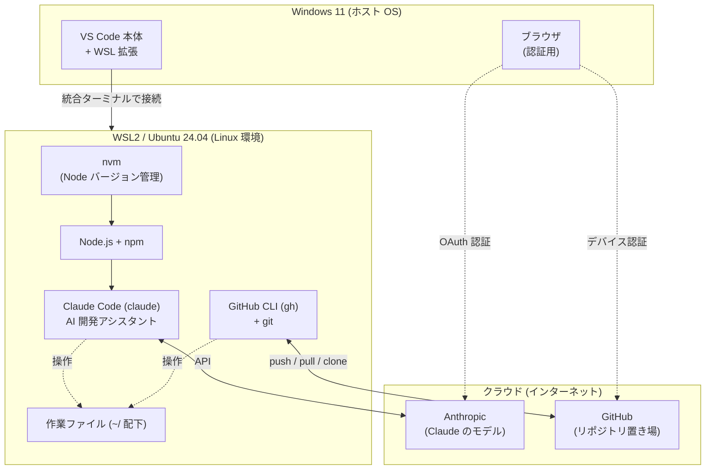

# WSL2 + Claude Code + GitHub 環境構築マニュアル

新規 Windows 11 PC からゼロで立ち上げる完全手順 — 2026年4月版

> このドキュメントはブラウザで読みながら手作業で構築するためのものです。Claude Code や WSL がまだ無い状態でも、上から順にコマンドをコピーして実行すれば環境が整います。各コードブロックの右上のコピーボタンでコマンドをそのままコピーできます。

## 目次

0. [全体像: 何を入れて何がどうつながるか](#0-全体像-何を入れて何がどうつながるか)
1. [事前準備と前提](#1-事前準備と前提)
2. [WSL2 + Ubuntu のインストール](#2-wsl2--ubuntu-のインストール)
3. [Ubuntu 初期セットアップ](#3-ubuntu-初期セットアップ)
4. [Node.js のインストール (nvm 経由)](#4-nodejs-のインストール-nvm-経由)
5. [Claude Code のインストールと認証](#5-claude-code-のインストールと認証)
6. [GitHub CLI (gh) のインストールと認証](#6-github-cli-gh-のインストールと認証)
7. [VS Code から WSL に接続して作業を開始](#7-vs-code-から-wsl-に接続して作業を開始)
8. [付録: トラブルシューティング](#8-付録-トラブルシューティング)
9. [構築完了後: 研究室ツールに触れる](#9-構築完了後-研究室ツールに触れる)

---

## 0. 全体像: 何を入れて何がどうつながるか

このマニュアルでは、Windows 11 の上に Linux 環境 (WSL2) を作り、その中に開発の中心となる
ツールを積み上げます。下の図は「何の上に何が乗るか」「どこと通信するか」を表します。



要点:

- **VS Code は Windows 側、開発ツールは WSL 側**。VS Code は WSL 拡張で WSL 内のシェルに
  つながり、その統合ターミナルから `claude` などを動かす (本体を二重に入れる必要はない)。
- **積み上げの順序**: WSL2 → Node.js (nvm 経由) → Claude Code、という依存がある。
  Claude Code は Node 上で動くので、先に Node が要る。
- **gh と git** はクラウドの GitHub とやり取りする窓口。認証だけ最初にブラウザで通す。

### 各ツールの役割

| ツール | 動く場所 | 役割 | 何に必要か |
|--------|----------|------|-----------|
| **WSL2 / Ubuntu** | Windows 上 | Linux 環境そのもの。以降のツールはすべてこの中に入る | 全ての土台 |
| **nvm** | WSL 内 | Node.js のバージョン管理。`apt` で入れるより切り替えが楽 | Node.js を入れるため |
| **Node.js + npm** | WSL 内 | JavaScript 実行環境とパッケージ管理。Claude Code の動作基盤 | Claude Code を動かすため |
| **Claude Code** (`claude`) | WSL 内 | 対話しながらコード編集・コマンド実行を行う AI アシスタント。以降の作業の中心 | 本マニュアルの主目的 |
| **GitHub CLI** (`gh`) + **git** | WSL 内 | リポジトリの clone・push・pull。`gh` が認証を肩代わりする | 研究室リポジトリの取得・共有 |
| **VS Code** + **WSL 拡張** | Windows 側 | エディタ。WSL に接続して WSL 内のファイルを編集、統合ターミナルで `claude` を起動 | 作業の操作画面 |

> このマニュアルは上から順に、土台から積み上げる構成になっています。各セクションが図の
> どの部分を入れているかを意識すると、今どこを作業しているか迷いません。

---

## 1. 事前準備と前提

### 必要な環境

- **Windows 11** の PC (Windows 10 では `wsl --install` による一括インストールがサポートされていないため、本マニュアルは Windows 11 を前提とします)
- 管理者権限のあるユーザーアカウント
- インターネット接続
- VS Code (Windows 側にインストール済みであること)
- GitHub アカウント (なければ github.com で先に作成しておく)

### このマニュアルの方針

- **VS Code への移行は最後に行う。** 先にプレーンな Ubuntu ターミナルで Claude Code と GitHub の認証まで通しておくと、トラブル時の切り分けが容易。
- 作業ファイルは必ず **WSL 側のホーム** (`~/` = `/home/ユーザー名`) に置く。`/mnt/c/...` は Windows ファイルシステムへのマウントで I/O が極端に遅くなる。

### 表記について

本マニュアルでは、コマンドを実行する場所を見出しで示します。コードブロックの直前のラベルを見て実行場所を判断してください。

- **PowerShell (Windows 側)** … Windows の PowerShell で実行
- **Ubuntu (WSL / Linux 側)** … Ubuntu のターミナルで実行
- **画面表示例** … コマンド実行後に画面に表示される内容の例

---

## 2. WSL2 + Ubuntu のインストール

### 2-1. PowerShell を管理者権限で起動

スタートメニューで「PowerShell」を検索 → 右クリック → 「管理者として実行」をクリック。

起動すると以下のような画面になります。

**画面表示例**

```text
Windows PowerShell
Copyright (C) Microsoft Corporation. All rights reserved.

PS C:\WINDOWS\system32>
```

### 2-2. Ubuntu をインストール

**PowerShell (Windows 側)**

```powershell
wsl --install -d Ubuntu-24.04
```

WSL2 のカーネルと Ubuntu 24.04 が同時に入ります。完了後、**Windows を再起動**してください (WSL の機能を有効化するため OS レベルの再起動が必要)。再起動すると自動で Ubuntu の黒いウィンドウが開くので、驚かずにそのまま次の 2-3 に進んでください。

### 2-3. ユーザー設定

再起動後、自動で Ubuntu のウィンドウが開きます (開かない場合はスタートメニューで「Ubuntu」を検索して起動)。以下のような画面が出ます。

**画面表示例**

```text
Installing, this may take a few minutes...
Please create a default UNIX user account. The username does not need to match your Windows username.
For more information visit: https://aka.ms/wslusers
Enter new UNIX username:
```

聞かれる順に入力します:

- **Enter new UNIX username**: 半角小文字英数字で短めに (例: `username`)。Windows のユーザー名と別で OK。
- **New password**: **入力中は画面に文字もカーソルも一切表示されませんが、これは Linux の正常な仕様です。** フリーズではないので、そのまま打って Enter を押してください。
- **Retype new password**: 確認用にもう一度同じパスワードを入力。

すべて完了すると以下のような表示になり、Linux のシェルに入ります。

**画面表示例**

```text
Welcome to Ubuntu 24.04 LTS (GNU/Linux ...)

To run a command as administrator (user "root"), use "sudo <command>".
See "man sudo_root" for details.

username@PC-NAME:~$
```

末尾の `username@PC-NAME:~$` がプロンプト (コマンド入力待ち状態) です。`username` 部分は自分が設定した名前、`PC-NAME` 部分は Windows のコンピュータ名が自動で入ります。

> このパスワードは Linux のユーザーパスワードで、`sudo` 実行時に毎回求められる大事なものです。忘れないようにしてください。

### 2-4. インストール確認

PowerShell に戻って以下を実行:

**PowerShell (Windows 側)**

```powershell
wsl --list --verbose
```

以下のような表示になっていれば成功です。

**画面表示例**

```text
  NAME            STATE           VERSION
* Ubuntu-24.04    Running         2
```

ポイント: `VERSION` 列が `2` になっていること、`STATE` が `Running` または `Stopped` のいずれかであること。

---

## 3. Ubuntu 初期セットアップ

### 3-1. Ubuntu ターミナルを起動

以下のいずれかの方法で起動できます:

- スタートメニューで「Ubuntu」を検索してクリック
- PowerShell で `wsl` と打って Enter
- Windows Terminal を開いて、タブの ▼ から「Ubuntu-24.04」を選択

起動直後の画面はだいたい次のいずれかの形になります。

**パターン A: ホームディレクトリで開く場合**

**画面表示例**

```text
username@PC-NAME:~$
```

末尾が `~$` になっているので、すでにホームディレクトリにいます。このまま次に進みます。

**パターン B: Windows のフォルダで開いた場合**

**画面表示例**

```text
username@PC-NAME:/mnt/c/WINDOWS/system32$
```

この場合、`/mnt/c/WINDOWS/system32` という場所にいます (Windows 側のフォルダ)。Linux のホームに移動するには:

**Ubuntu (WSL / Linux 側)**

```bash
cd ~
```

実行後、プロンプトが `username@PC-NAME:~$` に変わります。

### 3-2. apt の IPv4 強制設定 (重要)

WSL2 の NAT ネットワークは IPv6 のルーティングが不安定で、後続の `apt update` が `Network is unreachable` エラーで失敗することがあります。事前に IPv4 強制を設定しておきます。

**Ubuntu (WSL / Linux 側)**

```bash
echo 'Acquire::ForceIPv4 "true";' | sudo tee /etc/apt/apt.conf.d/99force-ipv4
```

初回 `sudo` なのでパスワードを聞かれます (Ubuntu 設定時に決めたもの)。実行後の画面表示:

**画面表示例**

```text
[sudo] password for username:
Acquire::ForceIPv4 "true";
username@PC-NAME:~$
```

2 行目に `Acquire::ForceIPv4 "true";` が表示されれば設定ファイルが正しく作られています。

> この設定は `apt` コマンドの通信のみに作用します。`curl`、`git`、`npm`、ブラウザなど他の通信には一切影響しません。

### 3-3. パッケージリストの更新と全体アップグレード

**Ubuntu (WSL / Linux 側)**

```bash
sudo apt update && sudo apt upgrade -y
```

初回は 5〜15 分程度かかります。`apt update` でパッケージカタログを取得し、`apt upgrade -y` でインストール済みパッケージを最新化します。多数の `Get:N ...`、`Unpacking ...`、`Setting up ...` という行が流れた後、最後にプロンプト `username@PC-NAME:~$` に戻れば完了です。

### 3-4. 開発用ツールのインストール

**Ubuntu (WSL / Linux 側)**

```bash
sudo apt install -y build-essential curl git
```

- `build-essential`: gcc / g++ / make。後続の Node ネイティブモジュールや Python パッケージのビルドで使用
- `curl`: nvm のインストールスクリプト取得などに使用
- `git`: バージョン管理ツール

### 3-5. Git の初期設定

コミットに記録される作者名とメールアドレスを設定します。**メールアドレスは GitHub に登録予定のものに合わせてください。**

**Ubuntu (WSL / Linux 側)**

```bash
git config --global user.name "Your Name"
git config --global user.email "your-email@example.com"
```

`"Your Name"` と `"your-email@example.com"` は**自分の名前と GitHub のメールアドレスに書き換えてから**実行してください (この例のままコピーしないこと)。

確認:

**Ubuntu (WSL / Linux 側)**

```bash
git config --global --list
```

**画面表示例**

```text
user.name=Your Name
user.email=your-email@example.com
```

> Linux ユーザー名 / GitHub ユーザー名 / Git の `user.name` はすべて独立で、揃える必要はありません。`user.email` だけは GitHub に登録するアドレスに合わせると、コミットがプロフィールと正しく紐づきます。

---

## 4. Node.js のインストール (nvm 経由)

### 4-1. nvm のインストール

`nvm` (Node Version Manager) は Node.js のバージョン管理ツール。`apt` で直接 Node を入れるよりこちらが推奨されます。

**Ubuntu (WSL / Linux 側)**

```bash
curl -o- https://raw.githubusercontent.com/nvm-sh/nvm/v0.39.7/install.sh | bash
```

### 4-2. 現在のシェルに反映

**Ubuntu (WSL / Linux 側)**

```bash
source ~/.bashrc
```

確認:

**Ubuntu (WSL / Linux 側)**

```bash
nvm --version
```

**画面表示例**

```text
0.39.7
```

### 4-3. Node.js 本体をインストール

**Ubuntu (WSL / Linux 側)**

```bash
nvm install --lts
```

最後に以下のような表示が出れば成功。Claude Code の要件は Node 18 以上なので余裕で満たせます。

**画面表示例**

```text
Now using node v22.x.x (npm v10.x.x)
Creating default alias: default -> lts/* (-> v22.x.x)
```

### 4-4. 確認

**Ubuntu (WSL / Linux 側)**

```bash
node --version
npm --version
```

両方バージョンが返ってくれば OK。`npm` は Node.js に同梱される、Node 用のパッケージマネージャです。

---

## 5. Claude Code のインストールと認証

### 5-1. Claude Code のインストール

**Ubuntu (WSL / Linux 側)**

```bash
npm install -g @anthropic-ai/claude-code
```

`-g` はグローバルインストールの意。どのディレクトリからでも `claude` コマンドが使える状態になります。

### 5-2. インストール確認

**Ubuntu (WSL / Linux 側)**

```bash
claude --version
```

### 5-3. 作業フォルダの作成

WSL 側ホーム配下にプロジェクト用フォルダを作成します。

**Ubuntu (WSL / Linux 側)**

```bash
mkdir -p ~/projects/test
cd ~/projects/test
```

プロンプトが以下のように変わります。

**画面表示例**

```text
username@PC-NAME:~/projects/test$
```

### 5-4. 起動と OAuth 認証

**Ubuntu (WSL / Linux 側)**

```bash
claude
```

初回起動で OAuth 認証フローが走ります。表示される URL を Windows 側ブラウザで開き、Anthropic アカウントでログインして認証を完了させてください。

WSL ではブラウザが自動で開かないことがあります。その場合はターミナルに表示された URL を**手でコピーして Windows 側のブラウザのアドレス欄に貼り付け**てください (これは WSL の仕様で、異常ではありません)。ログイン後に表示される認証コードをターミナルに貼り戻すと完了します。

> ここで認証した情報は `~/.claude/` に保存され、同じ WSL 内であれば再認証不要で共有されます。後で VS Code 内のターミナルから `claude` を起動しても、ここで通した認証がそのまま使われます。

### 5-5. 動作確認

Claude Code のプロンプト画面で簡単に問い合わせ:

```text
hello
```

応答が返ってくれば OK。終了は `/exit` または Ctrl + C を 2 回。

---

## 6. GitHub CLI (gh) のインストールと認証

### 6-1. gh のインストール

**Ubuntu (WSL / Linux 側)**

```bash
sudo apt update && sudo apt install -y gh
```

Ubuntu 24.04 の標準リポジトリに `gh` が含まれているので、これで入ります。

> **重要:** このコマンドは必ず Ubuntu のターミナルで直接実行してください。Claude Code セッション内で `!` プレフィックスを付けて `! sudo apt install -y gh` のように実行すると、対話式パスワード入力ができず `sudo: a terminal is required to read the password` エラーで失敗します。`sudo` を伴うコマンドは原則 Claude Code の外で実行するのが鉄則です。

### 6-2. 認証

**Ubuntu (WSL / Linux 側)**

```bash
gh auth login
```

対話式に進むので、矢印キーで以下を選択:

| 質問 | 選択 |
|---|---|
| What account do you want to log into? | **GitHub.com** |
| What is your preferred protocol for Git operations? | **HTTPS** |
| Authenticate Git with your GitHub credentials? | **Yes** |
| How would you like to authenticate GitHub CLI? | **Login with a web browser** |

### 6-3. ワンタイムコードの入力

以下のような表示が出ます。

**画面表示例**

```text
! First copy your one-time code: XXXX-XXXX
Press Enter to open github.com in your browser...
```

表示された 8 桁のコード (例: `1B93-DEFA`) をコピーしてから Enter。WSL ではブラウザの自動起動に失敗することが多く、以下のような表示が出ることがあります。

**画面表示例**

```text
! Failed opening a web browser at https://github.com/login/device
  exec: "xdg-open,x-www-browser,www-browser,wslview": executable file not found in $PATH
  Please try entering the URL in your browser manually
```

これは WSL の仕様で、認証自体は失敗していません。Windows 側のブラウザで手動で `https://github.com/login/device` を開き、コピーしておいたコードを貼り付けて認可してください。

認可が完了すると、Ubuntu 側のターミナルに以下のような表示が出ます。

**画面表示例**

```text
✓ Authentication complete.
- gh config set -h github.com git_protocol https
✓ Configured git protocol
✓ Logged in as your-github-username
```

### 6-4. 確認

**Ubuntu (WSL / Linux 側)**

```bash
gh auth status
gh repo list
```

`gh auth status` で `Logged in to github.com as ...` と出れば認証は確実に通っています。これで git の認証は完了です (`gh` が肩代わりするので、以降 `git push` のたびにパスワードを聞かれることはありません)。

---

## 7. VS Code から WSL に接続して作業を開始

### 7-1. WSL 拡張機能のインストール

Windows 側で VS Code を起動 → 左サイドバーの拡張機能アイコン → 検索欄に「WSL」と入力 → Microsoft 公式の **WSL** (発行元: Microsoft、ID: `ms-vscode-remote.remote-wsl`) をインストール。

### 7-2. WSL に接続

VS Code 左下の青い `><` マークをクリック → 「Connect to WSL」または「Connect to WSL using Distro...」→ `Ubuntu-24.04` を選択。

新しいウィンドウが開き、左下の表示が以下のようになれば接続成功です。

**画面表示例 (VS Code 左下)**

```text
WSL: Ubuntu-24.04
```

初回接続時は VS Code Server が WSL 側に自動でインストールされます (数十秒)。

### 7-3. プロジェクトフォルダを開く

「ファイル」→「フォルダーを開く」→ ダイアログのパス欄に直接入力:

```text
/home/username/projects/test
```

(`username` 部分は自分の Linux ユーザー名に置き換え)

### 7-4. VS Code 内で Claude Code を起動

「ターミナル」→「新しいターミナル」(ショートカット: Ctrl + `)。下部に開くターミナルは既に WSL 内のシェルです。

**Ubuntu (WSL / Linux 側) — VS Code 統合ターミナル**

```bash
claude
```

セクション 5 で認証済みなので、再認証なしでそのまま起動します。

### 7-5. 拡張機能について

このセットアップで VS Code に必須なのは **WSL** 拡張 (7-1) だけです。これで WSL 内の
シェルにつながり、統合ターミナルから `claude` を実行できます。

Python の補完やノートブックなど、各自の作業に応じた拡張は必要になった時点で入れれば
十分です。最初から揃える必要はありません。

---

## 8. 付録: トラブルシューティング

### WSL のインストール後 Ubuntu ターミナルが開かない

PowerShell で `wsl --list --verbose` を実行。Ubuntu が表示されない場合は再度 `wsl --install -d Ubuntu-24.04`。表示されているのに起動しない場合は `wsl -d Ubuntu-24.04` で明示起動してください。

### apt update が Network is unreachable で失敗する

セクション 3-2 の IPv4 強制設定を実施してください。実施済みでも失敗する場合は DNS の問題の可能性。`/etc/resolv.conf` を確認し、必要なら `nameserver 8.8.8.8` を追記。

### sudo: a terminal is required to read the password

Claude Code のセッション内で `!` プレフィックスから `sudo` を実行した場合に発生します。**別の WSL ターミナルを開いてそこで直接実行**してください。これが鉄則です。

### Ubuntu のパスワードを忘れた

PowerShell で root として WSL に入ります:

**PowerShell (Windows 側)**

```powershell
wsl -u root
```

Ubuntu に root で入った状態で:

**Ubuntu (WSL / Linux 側)**

```bash
passwd username
```

(`username` 部分は自分の Linux ユーザー名に置き換え)

新しいパスワードを 2 回入力 → `exit` で抜ける。

### Claude Code の command not found

nvm 経由で Node を入れた直後はシェルが認識していないことがあります。ターミナルを一度閉じて開き直すか、`source ~/.bashrc` で解決します。

### gh auth login でブラウザが開かない

WSL では `xdg-open` 等の自動起動ツールが無いので失敗します (`Failed opening a web browser`)。これは想定内の挙動で、認証自体は成功します。表示されるワンタイムコードを Windows 側ブラウザで `https://github.com/login/device` に貼り付ければ問題なく完了します。

---

### 環境構築完了後の鉄則

1. 作業ファイルは必ず `~/` 配下 (Linux 側) に置く。`/mnt/c/` は遅い。
2. `sudo` が必要な操作は WSL ターミナルで直接行う。Claude Code の `!` 実行では失敗する。
3. `git` / `gh` / `claude` / `node` はすべて WSL 内で完結する。Windows 側に同等のものを別途入れる必要はない。

---

## 9. 構築完了後: 研究室ツールに触れる

ここまでで `claude` / `gh` / `git` が動く状態になりました。以降は **Claude Code を起動して対話しながら**各ツールを使います (このマニュアルのようにブラウザで読みながら手で打つ必要はもうありません)。

典型的な始め方:

**Ubuntu (WSL / Linux 側)**

```bash
cd ~
gh repo clone Maelab-ArchUT/<リポジトリ名>
cd <リポジトリ名>
claude
```

各リポジトリのルートには `CLAUDE.md` があり、そのツールの目的・実行方法・ディレクトリ構成が書かれています。Claude Code は起動時にこれを読むので、「このリポジトリで何ができるか教えて」と聞けば概要を説明してくれます。

> 研究室のリポジトリは GitHub Organization `Maelab-ArchUT` 配下にあります。アクセスできない場合は、管理者にコラボレーター招待を依頼してください。
